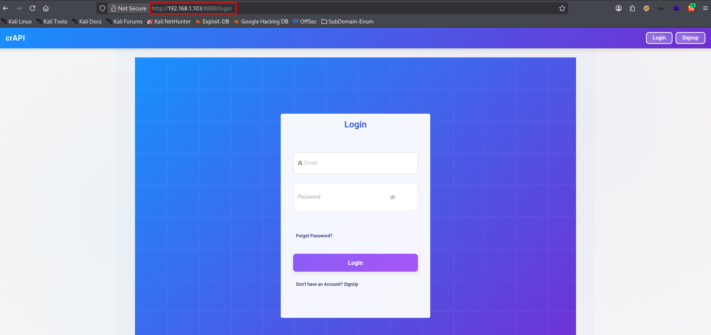
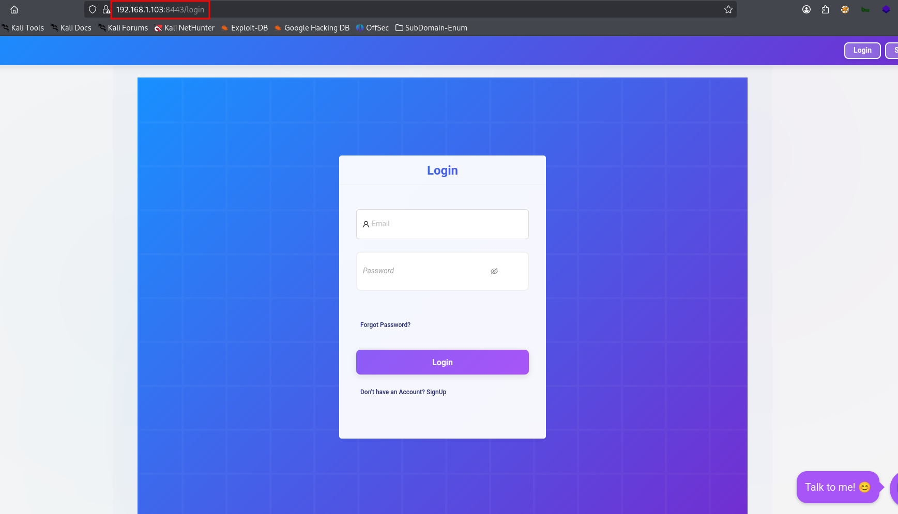
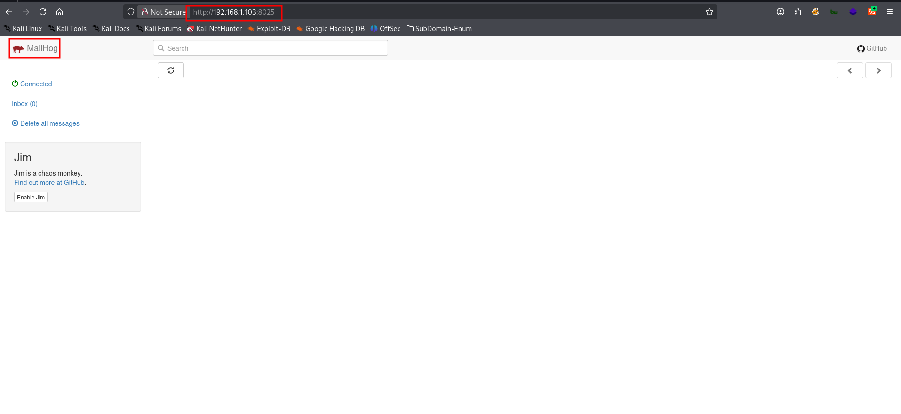

# 🧪 crAPI – Complete Lab Setup & Architecture Guide

## 🔗 Resources

* **Repository:** [https://github.com/OWASP/crAPI](https://github.com/OWASP/crAPI)
* **Docs:** [https://github.com/OWASP/crAPI/blob/develop/docs/overview.md](https://github.com/OWASP/crAPI/blob/develop/docs/overview.md)
* **Challenges:** [https://github.com/OWASP/crAPI/blob/develop/docs/challenges.md](https://github.com/OWASP/crAPI/blob/develop/docs/challenges.md)

## 🛠 Installation (Kali / Debian)


### 1️⃣ Update System

```bash
apt update
```

### 2️⃣ Install Docker & Docker Compose

```bash
apt install docker.io docker-compose -y
```


### 3️⃣ Enable & Start Docker Service

```bash
systemctl enable docker
```
```bash
systemctl start docker
```


### 4️⃣ Move to Working Directory

```bash
cd /opt
```
---

## 🚗 crAPI – Alternative Setup (Download ZIP Method)

### 📦 Download crAPI Source (ZIP)

```bash
curl -L -o /tmp/crapi.zip https://github.com/OWASP/crAPI/archive/refs/heads/main.zip
```

### 📂 Extract Files

```bash
unzip /tmp/crapi.zip
```

### 📁 Navigate to Docker Deployment Folder

```bash
cd crAPI-main/deploy/docker
```

### ⬇️ Pull Required Images

```bash
docker-compose pull
```

### 🚀 Start crAPI (Expose on All Interfaces)

```bash
LISTEN_IP="0.0.0.0" docker-compose -f docker-compose.yml --compatibility up -d
```
---

## 🚗 crAPI – Quick Setup (ZIP Method) -> top Combine command to use(Recomended)

> Its Working.

```bash
curl -L -o /tmp/crapi.zip https://github.com/OWASP/crAPI/archive/refs/heads/main.zip
unzip /tmp/crapi.zip
cd crAPI-main/deploy/docker
docker-compose pull
LISTEN_IP="0.0.0.0" docker-compose -f docker-compose.yml --compatibility up -d
```
---

### 🔍 Verify Deployment

```bash
docker ps
```
### 🌐 Access URLs

If your machine IP is:

```
192.168.1.103
```
---
### 🔗 Service Access Table

| Service            | URL                                                                  | Purpose        |
| ------------------ | -------------------------------------------------------------------- | -------------- |
| 🌐 Web App (HTTP)  | [http://192.168.1.103:8888/login](http://192.168.1.103:8888/login)   | Main UI        |
| 🔐 Web App (HTTPS) | [https://192.168.1.103:8443/login](https://192.168.1.103:8443/login) | TLS Testing    |
| 📧 Mailhog UI      | [http://192.168.1.103:8025](http://192.168.1.103:8025)               | Capture Emails |

 
 


---

### 🧠 Pentester Notes

* Use **HTTP (8888)** for normal testing
* Use **HTTPS (8443)** for TLS misconfiguration testing
* Mailhog helps test:

  * Email verification flows
  * Password reset attacks
  * Token leakage

---

- ### Any time to use this lab use this commands :

```bash
cd crAPI-main/deploy/docker
```
```bash
docker-compose pull                                
LISTEN_IP="0.0.0.0" docker-compose -f docker-compose.yml --compatibility up -d
```