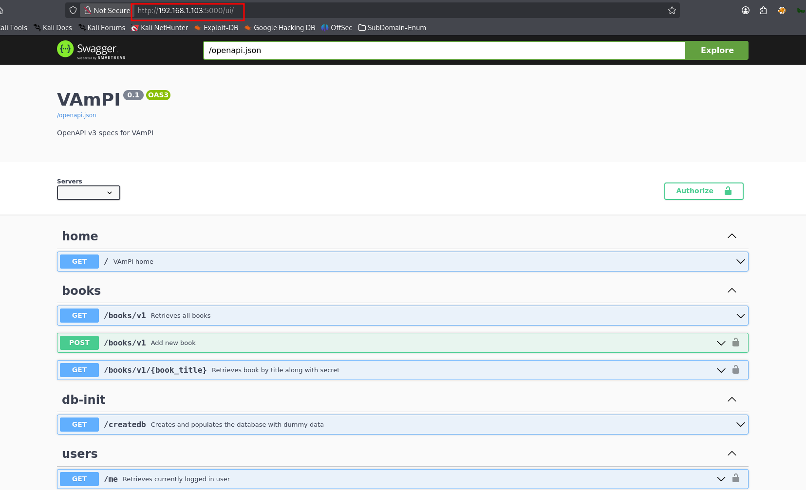

# 🧪 VAmPI – Lab Setup & Testing Guide

**Repository:** https://github.com/erev0s/VAmPI  

VAmPI = **Vulnerable API** built in Flask.  
It is intentionally designed to demonstrate **OWASP API Security Top 10 vulnerabilities** in a clean REST architecture.

---

## ⚙️ Installation Methods

> You used both options — either one is enough.


### 🚀 Option 1 – Run Prebuilt Image

```bash
docker run -d -e vulnerable=1 -e tokentimetolive=3000 -p 5000:5000 erev0s/vampi:latest
```
 Now Check the website:

- http://10.106.11.190:5000/
- http://10.106.11.190:5000/ui/


---

### 🐳 (Optional) 2 – Clone + Docker Compose

```bash
cd /opt
```

```bash
git clone https://github.com/erev0s/VAmPI.git
```

```bash
cd /opt/VAmPI
```

```bash
docker-compose up -d
```

---

### ✅ Verify Services

```bash
docker ps
```

```bash
netstat -nltup
```

---

## 🌐 Access URLs

If your IP is `192.168.1.28`:

| URL                         | Purpose     |
|----------------------------|------------|
| http://192.168.1.103:5000/   | API Root   |
| http://192.168.1.103:5000/ui | Swagger UI |

⚠️ Swagger UI is extremely useful for recon.


 

---

## 🏗️ Architecture Overview

VAmPI is:

- REST API  
- Flask-based  
- JWT Authentication  
- Single container (simpler than crAPI)  
- SQLite/Postgres (depending on config)  

---

## 🔎 Initial Recon Strategy

### Step 1 – Swagger Enumeration

Visit:

```text
http://192.168.1.103:5001/ui/
````

Check:

* All endpoints
* Required parameters
* Authentication requirements
* Response schema

This gives a complete attack surface.

---

### Step 2 – Identify Authentication Flow

Usually:

```text
POST /users/v1/login
POST /users/v1/register
```

Capture JWT and inspect:

* Header
* Payload
* Signature

---

## 5️⃣ Common Vulnerabilities in VAmPI

VAmPI intentionally contains:

---

### 1. Broken Object Level Authorization (BOLA)

**Example:**

```text
GET /users/v1/users/1
GET /users/v1/users/2
````

Change `user ID` → check if data leaks.

---

### 2. JWT Weakness

**Check:**

* Hardcoded secret in source
* Weak signing algorithm
* Role tampering

**Try:**

* Modify `role: admin`
* Change `user_id`
* Re-sign token if secret is known

---

### 3. Mass Assignment

When creating or updating user:

```json
{
  "username": "rahul",
  "password": "test",
  "admin": true
}
````

Try adding hidden fields like:

* is_admin
* role
* balance

---

### 4. Excessive Data Exposure

API might return:

```json
{
  "id": 1,
  "username": "admin",
  "password": "hashedvalue",
  "secret_key": "..."
}
```

Look for:

* Internal fields
* Debug information
* Unnecessary sensitive data

---

### 5. Rate Limiting Issues

Brute force login:

```bash
ffuf -X POST -d '{"username":"admin","password":"FUZZ"}' \
-u http://192.168.1.103:5001/users/v1/login \
-w rockyou.txt
```

Check:

* Account lockout?
* Rate limiting?
* Response difference?

---

### 6. Injection Testing

Test:

* SQL injection in parameters
* Command injection in search fields
* JSON injection

---

## 🧭 Recommended Pentest Flow (Professional Approach)

Since you're building API pentesting workflow, use this order:

1. Swagger Recon
2. Register account
3. Capture JWT
4. Test:

   * BOLA
   * JWT manipulation
   * Mass assignment
   * Injection
   * Role Termpering
   * ID enumeration
   * Rate limiting
   * test Injection
   * analyze error handling


## 📊 7️⃣ VAmPI vs vapi vs crAPI

| Feature         | vapi   | VAmPI  | crAPI    |
|----------------|--------|--------|----------|
| Difficulty     | Low    | Medium | High     |
| JWT Focus      | Limited| Strong | Advanced |
| Microservices  | No     | No     | Yes      |
| Business Logic | Minimal| Moderate| Advanced |
| Swagger        | No     | Yes    | Partial  |

---

VAmPI is perfect for:

- JWT exploitation practice  
- BOLA mastery  
- Learning API authorization flaws  

---

## 🛡️ 8️⃣ Map to OWASP API Security Top 10 (2023)

VAmPI covers:

- Broken Object Level Authorization  
- Broken Authentication  
- Excessive Data Exposure  
- Mass Assignment  
- Security Misconfiguration  
- Lack of Rate Limiting  

---

## 🚀 9️⃣ Advanced Mode

If you want deeper learning:

- Read source code (`app.py`, `config.py`)  
- Identify hardcoded secrets  
- Trace authorization decorators  
- Understand how JWT is validated  

Then exploit based on logic flaws instead of blind testing.