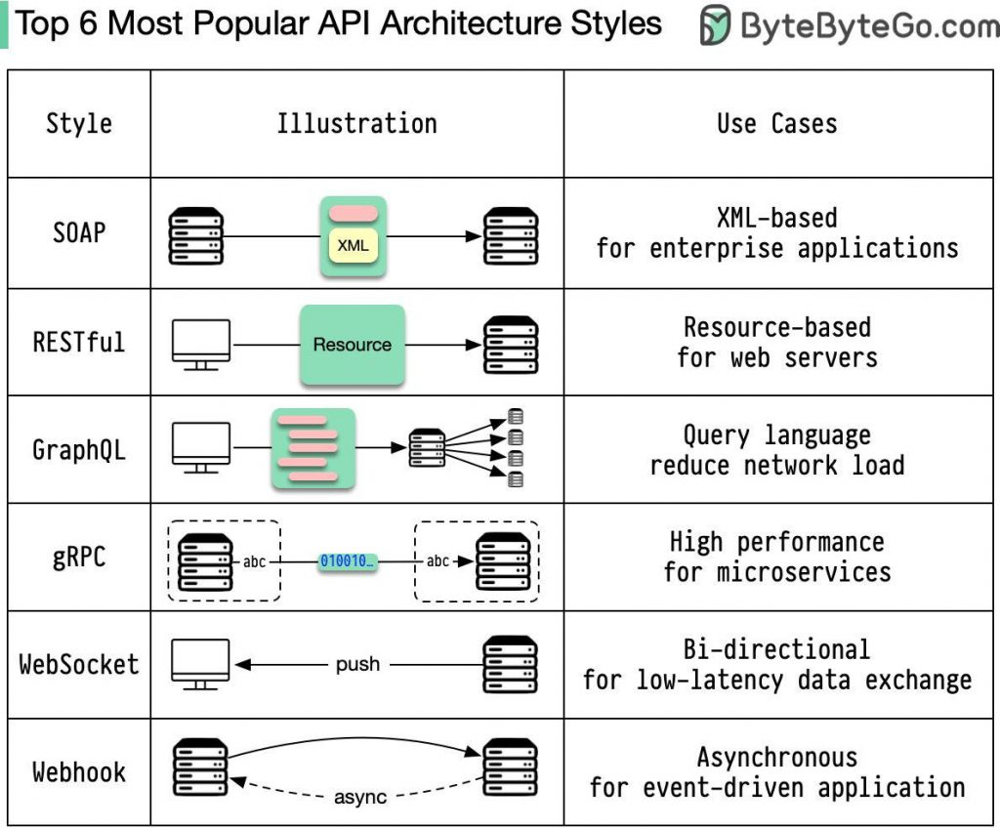

<!-- Animated Gradient Banner -->

  

  

---

# 🔐 API Pentest

> A complete guide to understanding APIs, HTTP fundamentals, and practical API penetration testing methodology.

This repository covers:

- 📘 API fundamentals  
- 🧩 Object & Action modeling  
- 🏗 Types of APIs  
- 🌐 HTTP protocol deep dive  
- 🛡 Security considerations for pentesting  

---

## 📚 Repository Structure

| File | Description |
|------|------------|
| 📘 [001 - Application Programming Interface (API)](001-Application%20Programming%20Interface%20(API).md) | API fundamentals & architecture |
| 🧩 [002 - Object and Action in API](002-Object%20and%20Action%20in%20API.md) | Resource modeling & HTTP actions |
| 🏗 [003 - Types of APIs](003-Types%20of%20APIs.md) | REST, SOAP, GraphQL, gRPC |
| 🌐 [004 - HTTP Protocol](004-HTTP-Protocol.md) | HTTP internals & security notes |

---

## 🚀 What You’ll Learn

### 🌐 API Fundamentals
- What is an API?
- API architecture styles
- Real-world API use cases

### 🔄 HTTP Deep Dive
- Request & Response structure
- HTTP methods
- Status codes
- Security headers
- Method misconfiguration

### 🛡 API Security (Pentesting Focus)
- BOLA / IDOR
- Broken authentication
- Rate limiting issues
- Injection in JSON
- Misconfigured CORS
- Missing security headers

---

## 🧠 API Architecture Overview

---

## 🔥 Supported API Technologies

  

| Style | Best For |
|-------|----------|
| 🌐 REST | Web & Mobile APIs |
| 🧼 SOAP | Enterprise systems |
| 🧩 GraphQL | Complex frontend apps |
| ⚡ gRPC | High-performance microservices |

---

## 🛠 Tools Covered (Security Perspective)

- 🐝 Burp Suite  
- 🔎 OWASP ZAP  
- 📬 Postman  
- ⚡ curl  
- 🎯 ffuf  
- 🔐 JWT tools  

---

## 🎯 Who Is This For?

- 🧑‍💻 Developers learning APIs  
- 🔐 Security researchers  
- 🕵️ Bug bounty hunters  
- 📚 Students learning web security  

---

## ⭐ Why This Repo?

This is not just theory.

It connects:

- 📖 Fundamentals  
- 🧠 Architecture  
- ⚙️ Protocol internals  
- 🛡 Real-world API attack surface  

---

  

