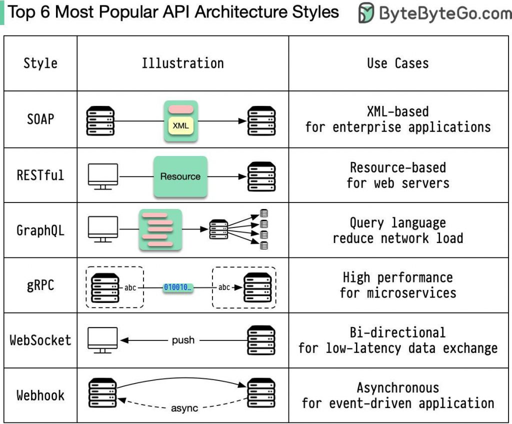

<!-- 🌊 Animated Header -->

  

<!-- ✨ Typing Animation -->

  

---

# 🔐 Network & API Pentesting Guide

> 🚀 A complete roadmap to mastering **Network Security, APIs, HTTP internals, and real-world penetration testing**

---

## 📌 About This Repository

This repository helps you understand:

- 🌐 Network + API fundamentals  
- 🧩 API design & architecture  
- 🏗 API technologies  
- 🔄 HTTP protocol deep dive  
- 🛡 Real-world API vulnerabilities & exploitation  

---

## 📚 Repository Structure

| 📂 File | 📖 Description |
|--------|--------------|
| 📘 [001 - API Basics](001-Application%20Programming%20Interface%20(API).md) | API fundamentals |
| 🧩 [002 - Object & Action](002-Object%20and%20Action%20in%20API.md) | Resource modeling |
| 🏗 [003 - API Types](003-Types%20of%20APIs.md) | REST, SOAP, GraphQL |
| 🌐 [004 - HTTP Protocol](004-HTTP-Protocol.md) | HTTP internals |
| 🔐 [005 - API Authentication](005-API%20Authentication.md) | Auth mechanisms |
| 🛡 [006 - OWASP API Top 10](006-OWASP%20API%20Security%20Top%2010.md) | Security risks |
| ⚙️ [007 - Lab Setup](007-API%20Penetration%20Testing%20–%20Lab%20Setup.md) | Environment setup |
| 🧪 [008 - crAPI Lab](008-crAPI%20–%20Complete%20Lab%20Setup.md) | Practice lab |
| 🎯 [009 - Pentest Methodology](009-API-Pentest-Methodology.md) | Testing workflow |
| ⚡ [010 - vAPI Labs](010-vAPI-labs-setup.md) | API lab setup |
| 🔎 [011 - VAmPI Lab](011-VAmPI%20–%20Lab%20Setup%20%26%20Testing%20Guide.md) | Vulnerable API |
| 🏦 [012 - Damn Vulnerable Bank](012-Damn%20Vulnerable%20Bank%20–%20Lab%20Setup%20%26%20API%20Pentesting%20Guide.md) | Banking API lab |
| 🔍 [013 - API Fuzzing](013-Finding%20Endpoints%20%26%20API%20Fuzzing%20Methodology.md) | Endpoint discovery |
| 🔓 [014 - BOLA](014-Broken%20Object%20Level%20Authorization%20(BOLA).md) | IDOR |
| 🔑 [015 - Broken Auth](015-Broken%20User%20Authentication.md) | Auth flaws |
| 📤 [016 - Data Exposure](016-Excessive%20Data%20Exposure.md) | Sensitive data leaks |
| 🚫 [017 - Rate Limiting](017-Rate%20Limiting.md) | Abuse controls |
| 🧱 [018 - BFLA](018-Broken%20Function%20Level%20Authorization%20(BFLA).md) | Privilege issues |
| ⚠️ [019 - Mass Assignment](019-%20Mass%20Assignment.md) | Input handling flaws |
| 🌍 [020 - SSRF](020-Server-Side-Request-Forgery(SSRF).md) | Server-side attacks |
| 💉 [021 - NoSQL Injection](021-NoSQL-Injections.md) | Injection attacks |
| 🧨 [022 - SQL Injection](022-SQL-Injection.md) | DB exploitation |
| 🧪 [023 - VAmPI SQLi Lab](023-VAmPI-Lab-SQL-Injection.md) | Practical SQLi |
| 🐳 [Docker Commands](Docker-commands.md) | Lab management |

---

## 🧠 API Architecture Overview

---

## 🚀 What You’ll Learn

### 🌐 Network + API Fundamentals
- API working & architecture  
- Network communication basics  
- Real-world API usage  

### 🔄 HTTP Deep Dive
- Request & Response structure  
- Methods & status codes  
- Headers & security controls  

### 🛡 API Security Testing
- 🔓 BOLA / IDOR  
- 🔐 Broken Authentication  
- 🚫 Rate Limiting Issues  
- 💉 Injection attacks  
- 🌍 SSRF  
- ⚠️ Mass Assignment  

---

## 🔥 Technologies Covered

  

---

## 🛠 Tools Used

- 🐝 Burp Suite  
- 🔎 OWASP ZAP  
- 📬 Postman  
- ⚡ curl  
- 🎯 ffuf  
- 🔐 JWT tools  

---

## 🎯 Who Is This For?

- 🧑‍💻 Developers  
- 🔐 Security Researchers  
- 🕵️ Bug Bounty Hunters  
- 📚 Students  

---

## ⭐ Why This Repo?

✨ Combines:

- 📖 Theory  
- ⚙️ Practical Labs  
- 🧠 Real Attack Scenarios  
- 🛡 Security Mindset  

---

## 📖 Reference

> 💡 Guided by:

- 👨‍🏫 **Sachin Verma Sir (Instructor)**  
- 🛡 **Armour Infosec**

🔗 https://www.armourinfosec.io/

---

<!-- 🌊 Footer -->

  

